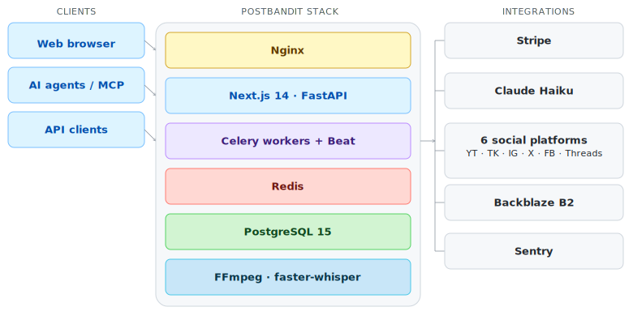

# PostBandit

[](https://python.org)
[](https://fastapi.tiangolo.com)
[](https://nextjs.org)
[](https://typescriptlang.org)
[](https://postgresql.org)
[](https://docs.celeryq.dev)
[](https://stripe.com)
[](https://docker.com)

**AI-native video-to-social platform.** Import any video, generate short-form clips with AI, burn in captions, write platform-specific copy, and schedule to 6 social platforms — with a public API and MCP integration for agent-driven automation.

🔗 **Live at [postbandit.com](https://postbandit.com)**

---

## Architecture



---

## Stack

| Layer | Technology |
|---|---|
| Frontend | Next.js 14 (App Router), TypeScript, Tailwind CSS, Recharts |
| Backend | FastAPI (Python 3.11), Pydantic v2 |
| Task queue | Celery 5 + Redis, Celery Beat for scheduled tasks |
| Database | PostgreSQL 15 |
| Video | FFmpeg, faster-whisper (CPU, int8, medium model), yt-dlp |
| AI | Claude Haiku (platform-aware copy generation) |
| Billing | Stripe (subscriptions, webhooks, customer portal) |
| Storage | Backblaze B2 offsite DB backups (S3-compatible via boto3) |
| Observability | Sentry (backend + frontend), `/health` endpoint |
| Infrastructure | Docker Compose, Nginx, Contabo VPS (8 vCPU / 24 GB RAM) |

---

## Features

**Content pipeline**
- Import from YouTube, Instagram, TikTok, Facebook, X, Twitch via yt-dlp
- Word-level transcription (faster-whisper) → AI clip scoring and detection
- FFmpeg caption burn-in: split-line (default), word-by-word karaoke, subtitle blocks
- Aspect ratio presets: 9:16 vertical, 16:9 horizontal, 1:1 square

**Publishing**
- Connect 6 platforms: YouTube, TikTok, Instagram, X, Facebook, Threads
- Per-platform scheduling — same clip to TikTok Monday, Instagram Wednesday
- Platform-aware AI copy: X (280 chars), Instagram (2200 + hashtag blocks), YouTube (keyword-rich description + tags), TikTok (trending CTAs), Facebook, Threads
- Content calendar with platform color coding, reschedule drawer, publish status tracking

**Analytics**
- Post performance pull-back from each platform: views, likes, comments, shares, reach
- Instagram analytics via `graph.instagram.com` (Login API — incompatible with Facebook Graph endpoint)
- 7/30/90-day date range filter, top performers list, Recharts views-over-time chart

**Developer platform**
- Public REST API v1 with API key auth (`pb_live_` prefix, SHA-256 hashed at rest, never stored plaintext)
- Redis sliding window rate limiting per user per plan (Creator: 200/hr, Pro: 1000/hr)
- MCP server integration (in progress — enables Claude to run full content workflows autonomously)

**Infrastructure**
- Stripe billing: 7-day trial (card required upfront), Creator $18/mo, Pro $49/mo, Elite $250/mo
- Idempotent Stripe webhook handling (`processed_stripe_events` dedup table)
- Automated daily PostgreSQL backups → Backblaze B2 (offsite)
- Fernet encryption at rest for all OAuth tokens
- SlowAPI rate limiting on auth endpoints

---

## Engineering notes

The decisions worth knowing about.

**Per-platform `publish_jobs` schema**

One row per platform per clip rather than one row with a `platforms[]` array. This enables independent scheduling, copy, status tracking, retry logic, and analytics per destination. A failed TikTok post doesn't block or affect the Instagram job for the same clip. The schema change is what makes the content calendar, per-platform analytics, and independent retries possible — it's not a delivery detail, it's the core architectural decision.

**Celery race condition**

The scheduled publishing task uses `SELECT FOR UPDATE SKIP LOCKED` combined with `countdown=1` on the downstream task. `SKIP LOCKED` lets competing workers skip rows already claimed by another worker rather than blocking. `countdown=1` ensures the publish task fires after the DB transaction commits rather than before, eliminating a class of subtle duplicate-dispatch bugs in high-concurrency conditions.

**OAuth token encryption**

All OAuth tokens for connected social platforms are encrypted at rest using Fernet symmetric encryption. Tokens are decrypted in memory only at the moment of platform API calls and are never logged or included in error messages. The encryption key lives exclusively in environment variables and is never present in application code or version control.

**API key auth as a parallel dependency**

API key authentication is implemented as a separate FastAPI dependency (`get_current_user_or_api_key`) applied only to `/api/v1/` routes. The original `get_current_user` dependency used by the dashboard is never modified — API key auth is purely additive. Rate limits are enforced per-user rather than per-key, so generating multiple API keys doesn't multiply the effective rate limit.

**Instagram API endpoint distinction**

Instagram Login API tokens are incompatible with `graph.facebook.com`. They require `graph.instagram.com`. This is significantly underdocumented by Meta and required targeted debugging to identify. Additionally, the `impressions` metric is unsupported for Reels media type — `views` is the correct metric for video content on Instagram.

**Backblaze B2 with boto3**

B2's S3-compatible API requires two non-obvious configurations: `signature_version="s3v4"` must be set explicitly in the boto3 config (the default AWS behavior doesn't apply), and the region must be a real region string like `us-west-004` rather than the `"auto"` shorthand that works with AWS S3. Both are silent failures without the fix — no error is raised, requests simply don't authenticate.

---

## Screenshots

<!-- Add dashboard, calendar, analytics, and publish flow screenshots here -->

| Dashboard | Content calendar |
|---|---|
| *coming soon* | *coming soon* |

| Analytics | Publish flow |
|---|---|
| *coming soon* | *coming soon* |

---

## Local development

### Prerequisites

- Docker + Docker Compose
- Python 3.11+
- Node.js 18+

### Setup

```bash
git clone https://github.com/TociNwaoha/clipbandit.git
cd clipbandit
cp .env.example .env
# Fill in required values — see .env.example for all required keys
docker compose up -d
```

### Services

| Service | URL |
|---|---|
| Frontend | http://localhost:3001 |
| Backend API | http://localhost:8000 |
| API docs (Swagger) | http://localhost:8000/docs |
| Health check | http://localhost:8000/health |

### Running workers

```bash
# Celery worker
docker compose up -d worker

# Celery Beat (scheduled tasks)
docker compose up -d worker-beat
```

---

## License

All rights reserved. © 2026 BANDAMONT LLC.

PostBandit is a proprietary commercial product. The source code is shared publicly for portfolio and review purposes only. No license is granted to use, copy, modify, or distribute this code for commercial or non-commercial purposes without explicit written permission from BANDAMONT LLC.
