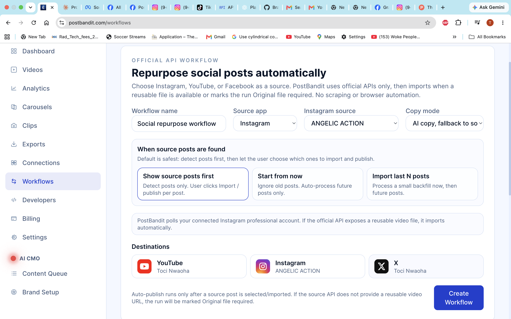
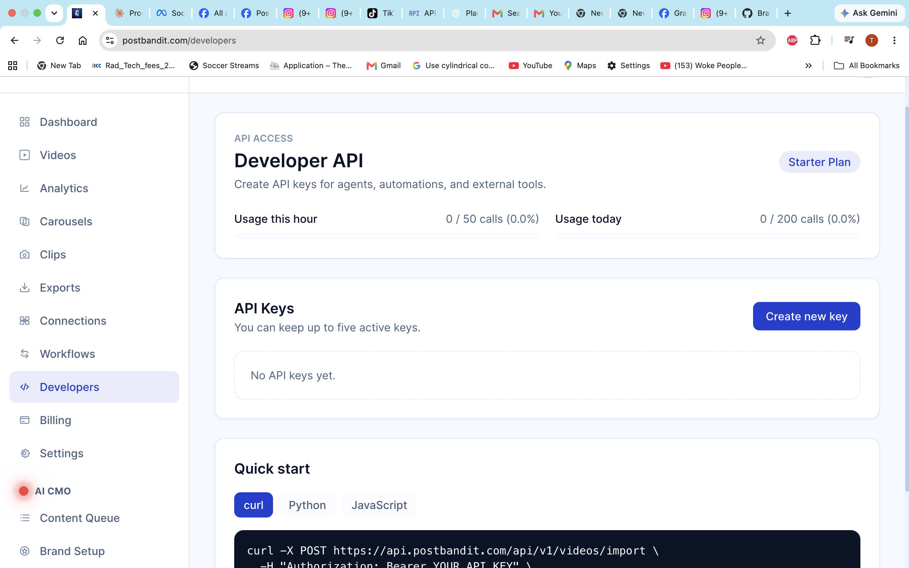
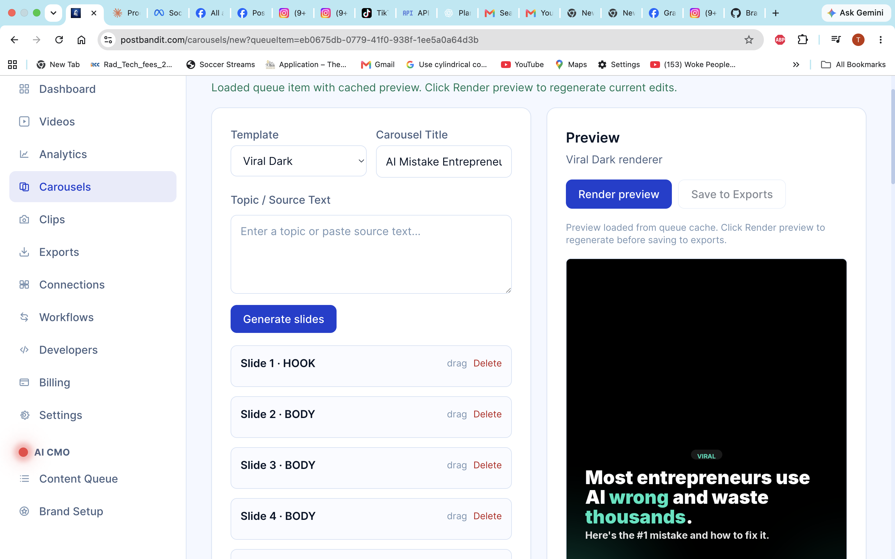
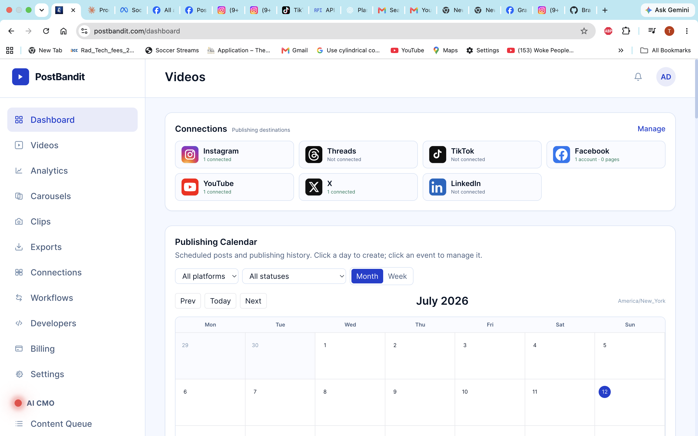
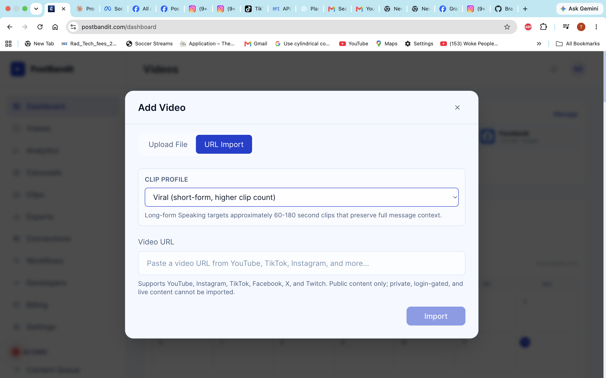
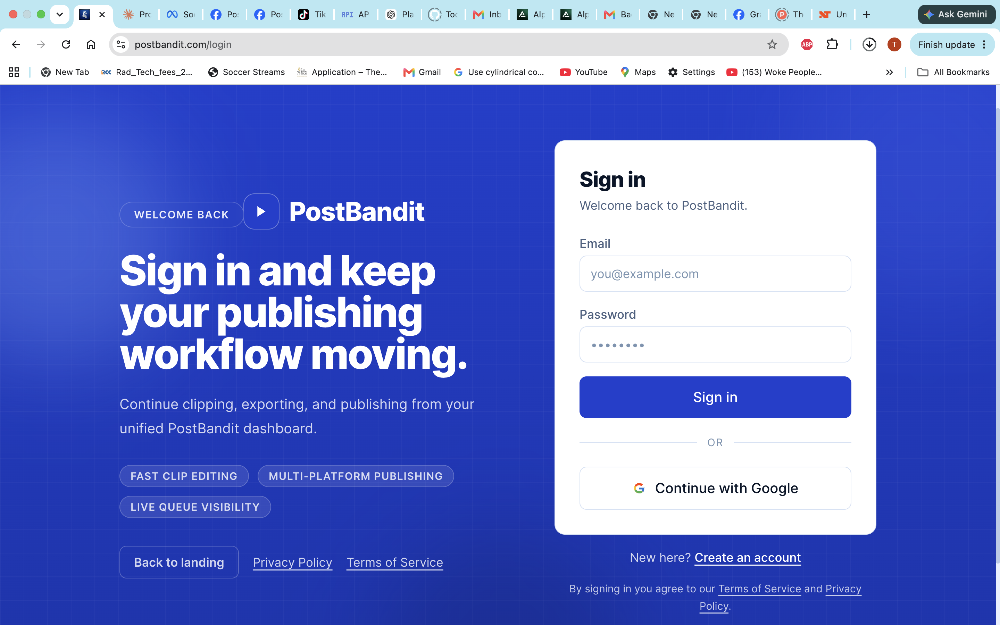

# PostBandit

AI-powered content workflow platform — import video, generate clips, publish everywhere.

[](https://www.python.org/)
[](https://nextjs.org/)
[](https://fastapi.tiangolo.com/)
[](https://www.docker.com/)
[](https://stripe.com/)

PostBandit is a clip-first publishing system for creators and teams. We ingest long-form video, transcribe it, identify usable moments, generate export-ready clips, write platform-specific copy, and manage delivery across social channels from one queue.

## Product Screenshots



*Workflow setup for repurposing source posts from Instagram, YouTube, or Facebook into selected destination accounts.*



*Developer API dashboard with usage limits, API key management, and quick-start snippets for external automation.*



*Carousel studio with template selection, editable slide structure, cached previews, and export-ready rendering.*



*Main dashboard with connected account status, publishing calendar, platform filters, and schedule visibility.*



*Video import flow for direct uploads and public URL imports from supported sources.*



*Authentication screen with product positioning around clipping, exporting, and multi-platform publishing.*

## What PostBandit Does

PostBandit is built for operators who want to turn existing video into publishable assets without rebuilding the same workflow by hand every day.

Core capabilities:

- Upload or import source video.
- Transcribe long-form media and keep word-level timing for captions.
- Score segments and generate clip candidates for short-form publishing.
- Render social-ready MP4 exports with captions, framing, thumbnails, and platform metadata.
- Schedule and publish to connected social destinations.
- Track publish history, retries, published URLs, and post analytics.
- Create carousel drafts from brand context and content queue items.
- Expose selected operations through a developer API for external systems.

## Engineering Decisions

| Area | Decision | Why it matters |
|---|---|---|
| Frontend | Next.js 14 App Router with TypeScript | The dashboard needs server-rendered routes, isolated client components, and strong type coverage without adding a separate frontend service layer. |
| Backend | FastAPI with SQLAlchemy and Alembic | FastAPI keeps API contracts explicit, SQLAlchemy gives predictable relational modeling, and Alembic makes schema changes reviewable. |
| Video processing | FFmpeg workers | Rendering is CPU-heavy and failure-prone, so it belongs in isolated worker jobs rather than request handlers. |
| Transcription | faster-whisper | We keep transcription local to control cost, avoid per-minute cloud transcription pricing, and reduce dependence on external APIs for core processing. |
| Job processing | Celery with Redis | Imports, transcription, scoring, rendering, publishing, cleanup, and scheduled jobs all need retries and isolation from web requests. Celery gives us that without inventing our own queue. |
| Database | PostgreSQL 15 | The product relies on durable state: videos, clips, exports, connected accounts, publish jobs, schedules, analytics, and billing history. PostgreSQL is the right default for that shape. |
| Storage | Backblaze B2 | The app stores many small media artifacts and generated outputs. B2 gives lower storage cost than S3 for this workload while still supporting S3-compatible tooling through boto3. |
| Payments | Stripe Checkout, Billing Portal, and webhooks | Stripe owns subscription state, while PostBandit stores normalized billing fields and processed webhook events for idempotency. |
| Observability | Sentry and health checks | Background workers and third-party APIs fail in different ways. Centralized error reporting and simple health endpoints make production debugging faster. |

The primary language model used for copy generation is DeepSeek. We keep provider-facing code behind service boundaries so copy generation can fail cleanly without blocking media processing.

## Architecture

We structure the product around two workflows: clip-first and publish-first.

In the clip-first workflow, a user uploads or imports a video. We store the source object, enqueue transcription, generate word-level transcript data, score candidate moments, create clip rows, generate thumbnails, and render exports through FFmpeg. The web app stays responsive because all heavy work runs in Celery workers. The exported asset becomes the stable unit for download, scheduling, publishing, retrying, and analytics.

```text
source video -> object storage -> transcription -> clip scoring -> review -> export render -> publish or download
```

In the publish-first workflow, a user connects source and destination accounts. We poll supported source platforms, detect posts, import reusable media when the official API exposes it, and create destination-specific publish jobs. A publish job is intentionally one platform/account/destination at a time. That keeps scheduling, retries, errors, and analytics independent across platforms.

```text
connected source -> source post ledger -> media import or recovery -> export -> destination publish jobs -> calendar and analytics
```

The deployed stack is a Docker Compose application behind Nginx. It runs a Next.js frontend, FastAPI backend, PostgreSQL, Redis, Celery workers, and Celery Beat. Backblaze B2 stores durable media and backup artifacts. Local volumes are used only for runtime state, temporary processing, and compatibility paths that are intentionally being retired.

## Local Development

### Prerequisites

- Docker and Docker Compose
- Git
- Node.js 20+ for frontend-only work outside Docker
- Python 3.11+ for backend tooling outside Docker

### Setup

```bash
git clone https://github.com/TociNwaoha/postbandit.git
cd postbandit
cp .env.example .env
```

Fill in `.env` with the services you plan to run locally. The full production feature set needs database, Redis, auth, storage, AI provider, Stripe, and social OAuth credentials. You can still run smaller slices of the app with only the services required by the route you are testing.

### Run

```bash
docker compose up -d --build
```

Useful local endpoints:

| Service | URL |
|---|---|
| Frontend | http://localhost:3001 |
| Backend API | http://localhost:8000 |
| API docs | http://localhost:8000/docs |
| Health check | http://localhost:8000/health |

Common commands:

```bash
# Show container status
docker compose ps

# Tail backend logs
docker compose logs -f backend

# Tail worker logs
docker compose logs -f worker

# Apply database migrations
docker compose exec backend alembic upgrade head

# Rebuild only the frontend
docker compose up -d --build frontend
```

## License

MIT
