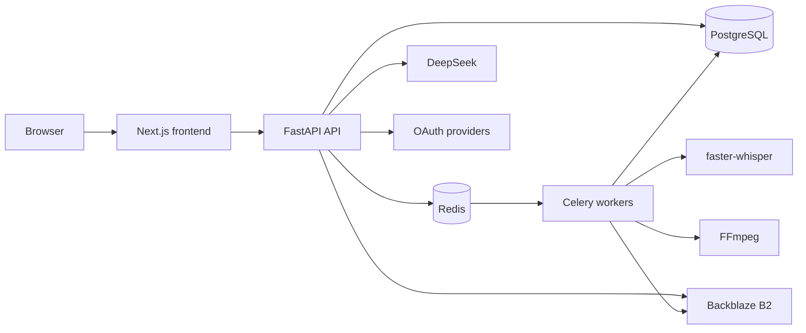

# PostBandit

[postbandit.com](https://postbandit.com) · [Repository](https://github.com/TociNwaoha/postbandit)

PostBandit is a video-repurposing system for creators and teams that turns uploaded or imported source video into captioned clips and platform-specific publishing jobs.

## Architecture

The repository contains a Next.js 14 / TypeScript frontend and a FastAPI / SQLAlchemy backend. PostgreSQL is the system of record, with Alembic migrations in `backend/alembic`. Celery workers use Redis for queueing and execute the media pipeline outside request handlers.


```mermaid
flowchart LR
    browser[Browser] --> web[Next.js frontend]
    web --> api[FastAPI API]
    api --> db[(PostgreSQL)]
    api --> queue[(Redis)]
    api --> storage[Backblaze B2]
    api --> copy[DeepSeek]
    api --> oauth[OAuth providers]
    queue --> workers[Celery workers]
    workers --> whisper[faster-whisper]
    workers --> ffmpeg[FFmpeg]
    workers --> db
    workers --> storage
```

- **Frontend:** Next.js 14 App Router, TypeScript, and NextAuth.
- **API and persistence:** FastAPI, SQLAlchemy, PostgreSQL 15, and Alembic.
- **Async work:** Celery queues for ingest, transcription, scoring, rendering, publishing, analytics, cleanup, and scheduled work; Redis provides the broker and result backend.
- **Media:** `faster-whisper` runs transcription locally. FFmpeg extracts audio and thumbnails and renders exports.
- **External services:** Backblaze B2 stores media through its S3-compatible API; DeepSeek generates copy and carousel content; Sentry is initialized in the API, workers, and Next.js runtime.
- **Deployment:** Docker Compose defines the frontend, API, PostgreSQL, Redis, Celery workers, and Celery Beat services.

The repository does not contain an Nginx configuration, so this README does not make a deployment-proxy claim that cannot be reviewed here.

## Integrations

The publishing registry has concrete OAuth2 adapters for:

- YouTube
- TikTok
- Instagram
- Facebook
- X
- Threads

Instagram, Facebook, and Threads use the Meta family of APIs. LinkedIn is deliberately not listed: its adapter is an unconfigured scaffold, not a working integration.

The repository contains Meta-review UI and TikTok publishing code, but does not provide source-verifiable evidence of formal app-review outcomes. Those outcomes are therefore not represented as engineering claims here.

## Testing

Backend tests live in `backend/tests` and run with `pytest`. The repository’s CI setup and 165-test result currently live on the separate [`ci/test-suite`](https://github.com/TociNwaoha/postbandit/tree/ci/test-suite) branch, not on `main`; merge that branch before advertising a default-branch CI status badge.

## Local development

### Docker Compose stack

Prerequisites: Docker Desktop with Compose and Git.

```bash
git clone https://github.com/TociNwaoha/postbandit.git
cd postbandit
cp .env.example .env
docker compose up --build
```

The example environment supplies local PostgreSQL and Redis settings. Replace placeholder values only for the external integrations you intend to exercise; do not commit `.env`.

After startup:

| Service | Address |
|---|---|
| Frontend | http://localhost:3001 |
| Backend API | http://localhost:8000 |
| API documentation | http://localhost:8000/docs |
| Health check | http://localhost:8000/health |

### Backend tests outside Docker

Prerequisites: Python 3.11.

```bash
python3.11 -m venv .venv
source .venv/bin/activate
python -m pip install -r backend/requirements.txt pytest-cov
cd backend
THUMBNAIL_DIR=/tmp/clipbandit-test-thumbnails pytest -q
```

## License

All rights reserved. © 2026 BANDAMONT LLC. The source is public for portfolio and technical review; no license is granted for reuse without written permission.
